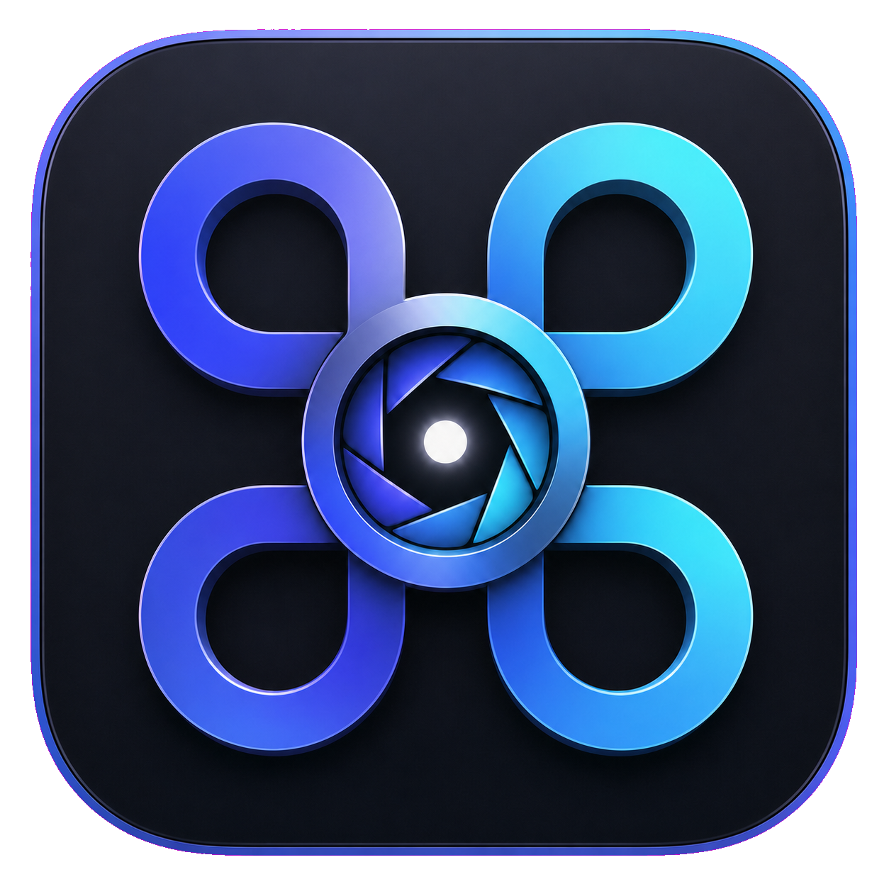

<p align="center">
  
</p>

<h1 align="center">CmdSpace</h1>

<p align="center">
  Fast, local-first search for your Mac
</p>

CmdSpace is a small native macOS launcher intended to replace Spotlight on
<kbd>⌘</kbd><kbd>Space</kbd>. It builds its own filename index of the startup
drive, follows filesystem changes as they happen, and learns from items opened
through CmdSpace.

## Install

Download the latest
[CmdSpace DMG](https://github.com/jvanderberg/cmdspace/releases/latest),
open it, and drag CmdSpace to Applications.

CmdSpace requires macOS 13 or newer. The first index may take a few minutes.
Existing results remain searchable while later refreshes run.

## New in 0.1.2

### Live indexing

CmdSpace now follows filesystem changes continuously while it is running.
Created and renamed folders have their contents indexed, removed folders are
deleted from results, and changes made while CmdSpace was closed replay from
the macOS event journal after relaunch.

The initial full-drive index remains available for reconciliation. It defaults
to **Manual only** because live updates normally keep the index current.
Optional 6-hour, 12-hour, daily, and weekly schedules remain available.
CmdSpace also reconciles automatically if macOS reports an event-history gap.

### Quick Look and file actions

After moving through results with the arrow keys, press <kbd>Space</kbd> to
preview the selected file with Quick Look. Press <kbd>⌘</kbd><kbd>K</kbd> or
right-click a result for these actions

- Open
- Quick Look
- Reveal in Finder
- Copy Path
- Open With
- Move to Trash
- Terminal from Here for folders

Move to Trash uses the macOS Trash, so the item remains recoverable.

### Calculator, conversions, and dates

Type calculations directly into Search and press Return to copy the result.
CmdSpace supports arithmetic, percentages, factorials, functions, constants,
complex numbers, and natural-language operators.

Unit conversion covers length, area, volume, mass, temperature, speed, time,
storage, angle, energy, power, pressure, and frequency. Ambiguous ounces use
the destination dimension, so `20 ounces in milliliters` means fluid ounces
while `20 ounces in grams` means weight ounces.

English date phrases support relative dates, date differences, and weekdays.
Business days mean Monday through Friday and do not include holiday calendars.

```text
30 days from today
July 25 + 6 weeks
days until Christmas
business days between August 1 and September 15
```

## What it does

- Indexes application names, file names, and folder names (not file contents).
- Tracks filesystem changes live and replays changes made while CmdSpace was
  not running.
- Opens from a fast keyboard-first floating launcher.
- Previews selected files with Quick Look after navigating with the arrow keys.
- Provides contextual actions for revealing, copying paths, choosing an app,
  and moving items to Trash.
- Browses largest files and most recently modified files via the mode switch
  or ⌘1/⌘2/⌘3, and searches the web with ⌘4.
- Ranks exact and prefix matches first, then boosts items by launch frequency
  and recency.
- Keeps apps first by default, with a setting to use normal relevance instead.
- Calculates expressions, converts common units, and handles English date
  phrases such as `30 days from today` directly in Search.
- Shows live web results and opens full searches with your chosen provider.
- Stores the index and launch history locally in
  `~/Library/Application Support/CmdSpace/index.sqlite3`.
- Tolerates unreadable folders and reports progress in the launcher.
- Includes in-app Settings for refresh timing, ranking, launch at login,
  permissions, and manual refresh, plus a complete Help window.

CmdSpace scans the sealed System and writable Data APFS volumes separately,
then maps Data-volume paths back to their familiar `/Users` and `/Applications`
spellings. It skips caches, cloud-provider roots, automount triggers, container
data, VCS internals, dependency trees, temporary volumes, and other high-noise
locations. It does not use or modify Spotlight's index.

Live filesystem updates keep the index current. Full reconciliation is
available manually or on an optional schedule and runs automatically when
macOS reports an event-history gap.

## Build and run

Requires macOS 13 or newer and Xcode command-line tools.

```sh
chmod +x scripts/build-app.sh
./scripts/build-app.sh
open .build/CmdSpace.app
```

Release builds automatically use the first installed Developer ID Application
certificate, preserving identity-keyed privacy grants across rebuilds. Set
`CODESIGN_IDENTITY=-` to force ad-hoc signing, or pass an exact identity in
`CODESIGN_IDENTITY`.

For a stable installation whose Full Disk Access grant survives rebuilds

```sh
chmod +x scripts/install-app.sh
./scripts/install-app.sh
```

This Developer ID-signs CmdSpace, installs it at `/Applications/CmdSpace.app`,
verifies the installed signature, and relaunches that copy.

## Claim ⌘Space

macOS reserves <kbd>⌘</kbd><kbd>Space</kbd> for Spotlight by default

1. Open **System Settings → Keyboard → Keyboard Shortcuts → Spotlight**.
2. Turn off “Show Spotlight search”.
3. Quit and reopen CmdSpace.

If the shortcut is still occupied, CmdSpace stays available from its menu-bar
icon and shows a warning in that menu.

## Permissions

CmdSpace indexes every location macOS lets it read. To include protected
locations, add `CmdSpace.app` under **System Settings → Privacy & Security →
Full Disk Access**, then choose **Refresh Index** from its menu-bar icon.

## Tests

```sh
swift test
```

## Build a DMG

```sh
./scripts/build-dmg.sh
```

The DMG and SHA-256 checksum are written to `dist`.

Public distribution also requires Apple notarization. Store credentials in a
notarytool keychain profile, then run

```sh
./scripts/build-release.sh YOUR_KEYCHAIN_PROFILE
```

This signs with hardened runtime and trusted timestamps, notarizes and staples
the app, builds the DMG, then notarizes and staples the DMG.
